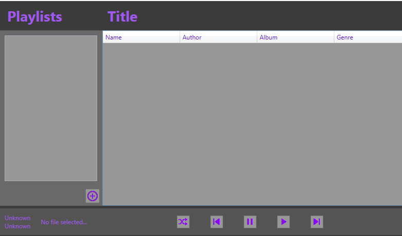

  

A small project developped by Anna Moscoloni and myself. As the final project of our Programming 3 class. It has the ability to play any commonly used music format and is able to save playlists in the form of XML,
as we had yet to be introduced to databases. 
  

## Contributors ✨

<!-- ALL-CONTRIBUTORS-LIST:START - Do not remove or modify this section -->
<!-- prettier-ignore-start -->
<!-- markdownlint-disable -->
<table>
  <tr><td align="center"><a href="https://github.com/amoscoloni"> <b>Anna Moscoloni</b><tr><tr><td align="center"><a href="https://github.com/2076242"> <b>Tyler Johnson</b></tr>
</table>